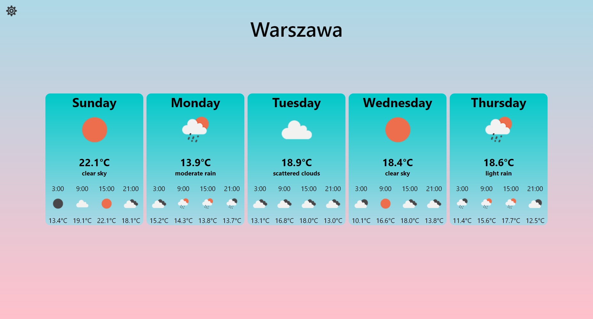
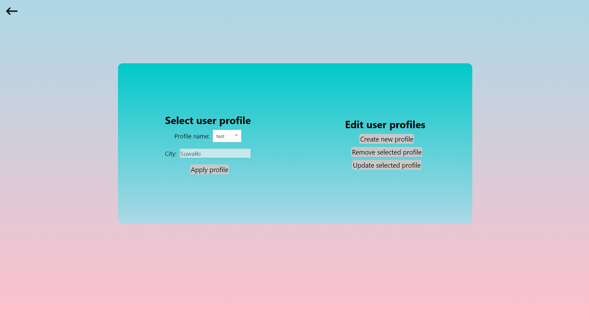

# PAP21L-Z09

Projekt z przedmiotu Programowanie aplikacyjne

## Lista członków zespołu:
* Bartłomiej Piktel
* Jan Jeschke

## Temat projektu:
`Aplikacja webowa do wyświetlania pogody i serwer dostarczający dane pogodowe`

### Zawartość projektu:
* aplikacja webowa - folder weatherapp ([więcej informacji](./weatherapp/README.md))
* serwer - folder weatherapp-server ([więcej informacji](./weatherapp-server/README.md))

### Wymagania środowiskowe:
* Java 11
* Apache Maven
* Node.js oraz npm

### Uruchamianie projektu (w wersji development):
* Aplikacja webowa:  
`cd weatherapp`  
przed pierwszym uruchomieniem `npm install`  
`npm start`
* Serwer:  
`cd weatherapp-server`  
`./mvnw spring-boot:run` lub na systemie Windows `.\mvnw.cmd spring-boot:run`

Uwaga: Przed uruchomieniem serwera należy uzupełnić dane dostępu do serwera Oracle Database w pliku resources/application.properties.

